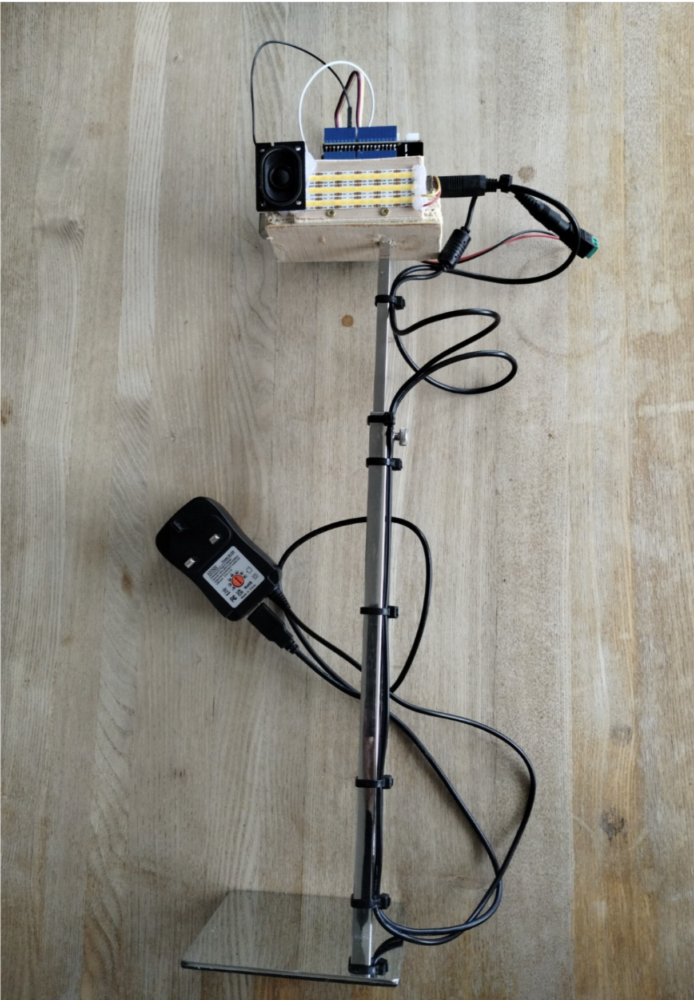
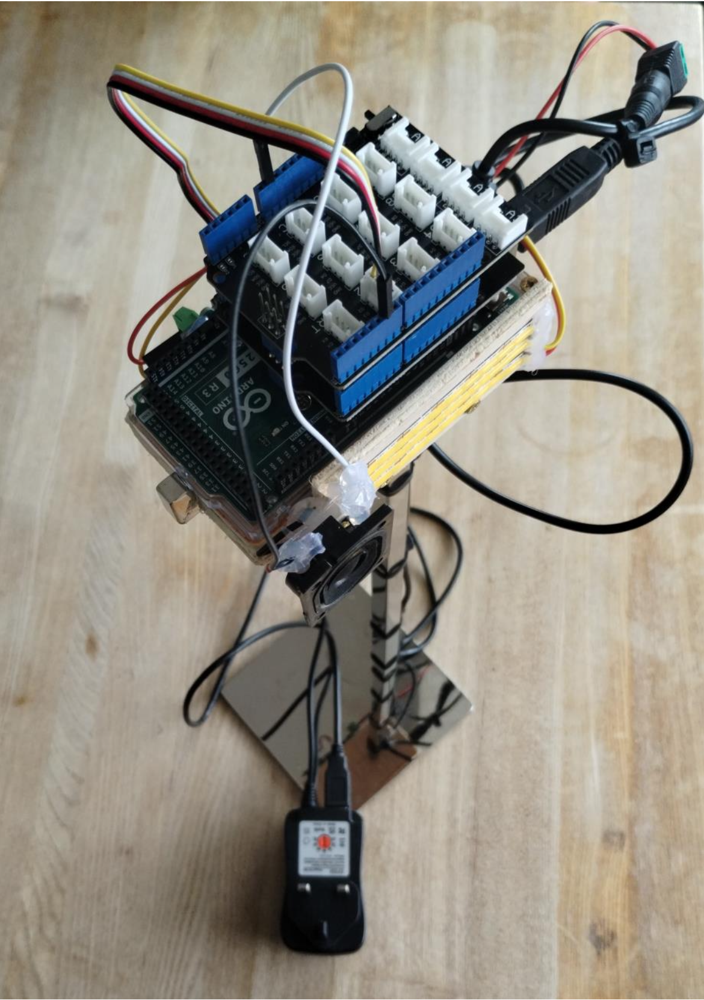
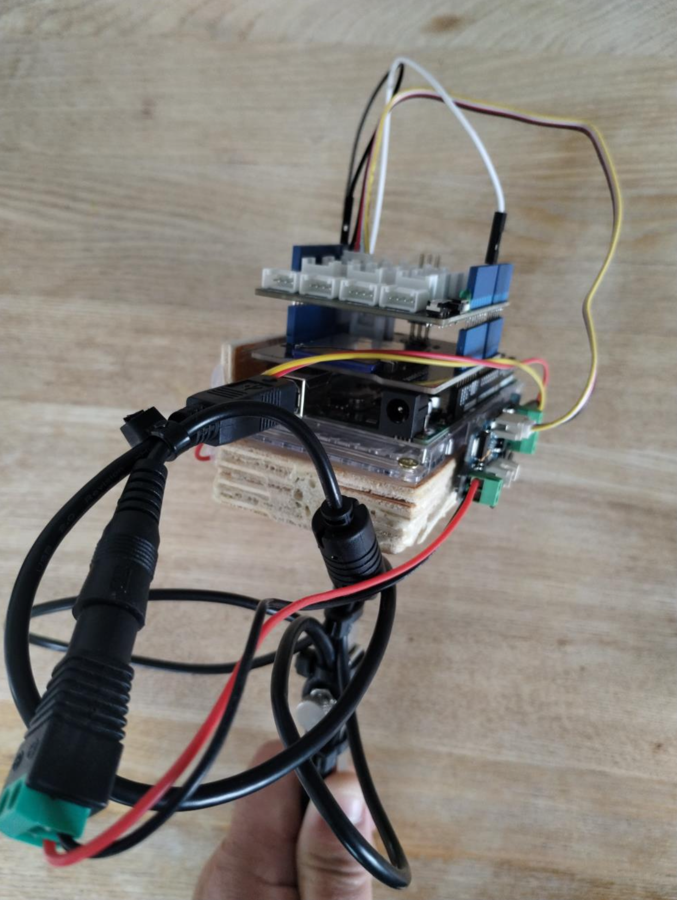

## Requirements 

Flash an LED light for half a second whilst playing white noise. The flashing/noise should repeat with random intervals of 2-6 seconds. 

## Equipment

* Arduino R3 Mega or equivalent with USB-A to USB-B cable (£16) 

  e.g. https://www.amazon.co.uk/ELEGOO-Controller-ATmega2560-ATMEGA16U2-Compatible/dp/B06XKMZ3T9 

* Selection of multicolored dupont wires (£6) 
https://www.amazon.co.uk/Elegoo-120pcs-Multicolored-Breadboard-arduino-colorful/dp/B01EV70C78 

* Seeed Grove Base Shield (£4.50) 

* Grove - Base Shield V2.0 for Arduino | The Pi Hut 

* Seeed Grove LED Strip Driver (£10) 

* Grove - LED Strip Driver | The Pi Hut 

* Seeed Grove SD Sheild (£14)

  https://thepihut.com/products/seeed-sd-card-shield-v4-0 

* Small 16ohm/1W speaker (£4) 
  
  https://www.ebay.co.uk/itm/276483867624  

* Variable power adaptor (with USB socket built in) (£10) 

  https://www.amazon.co.uk/dp/B0829R1GD7  

* SD or Micro SD Card under 2GB (£7 or from an old phone/camera from 2005) 

  https://www.amazon.co.uk/Hama-High-Speed-Secure-Digital/dp/B000BGFJI6  

* White LED strip light with just +ve and –ve connections. (£10) 

  https://www.amazon.co.uk/PAUTIX-Dimmable-Backlight-Flexible-Lighting/dp/B08XBDHSZW  

 

 

## Preparation & Notes

The LED strip driver required its own power source and the variable power adaptor with built in USB allowed for a us to 
use the main output with the screw terminal connector to power the LED strip driver and for the USB-A to USB-B cable to 
power the Arduino base unit. 

From the LED lights, cut 3 x 6 LED sections. These will need to be soldered in series to connect the ground/positives 
together from each alternate end. I left the initial power supply wires with the male DuPont pins connected for ease of 
connection to the LED strip driver. 

The white noise WAV file was created based of these instructions: 
[Music Player Using Arduino : 5 Steps - Instructables](https://www.instructables.com/Music-Player-Using-Arduino/)

The speaker supplied by the client needed the wires soldered, as opposed to the example in the link above which could 
connect without soldering. 

My soldering iron and skills are poor, and I had issues getting the solder to stick to the LED terminals. So, to help 
endure connections, I bodged all the soldering with the help of a hot glue gun.  

There is no doubt a cheaper/simpler  way to create this if you use individual capacitors and resistors etc. 

 

## Initial Assembly 

### Boards 

With the Arduino as the base, plug the SD shield in first and then the base shield on top. 

 

### Speaker 

Connect one speaker wire to Pin 6 on the base shield and the other to one of the ground GRD pins. 

 

### LED lights and Driver 

Connect the ground wire to the ‘G’ terminal of the LED strip driver and the positive wire to the ‘+’ terminal of the 
LED Strip driver. Using stripped down cables, connect the power supply from the screw terminal adaptor that came with 
the power supply. 

With the cable that came with the LED strip driver, plug one end into the strip driver input and the other end into the 
top of the base shield in plug D2. 

 

## The Code 

Ardino Pins used: 

Pin 6 – speaker wire 1 

GND – speaker wire 2 

The final code is a slight mash-up of the examples given with the RGB driver & LED Strip libraries. 

The code loaded for customer delivery: 
```
#include <SD.h>                      // need to include the SD library 

//#define SD_ChipSelectPin 53  //example uses hardware SS pin 53 on Mega2560 

#define SD_ChipSelectPin 4  //using digital pin 4 on arduino nano 328, can use other pins 

#include <TMRpcm.h>           //  also need to include this library... 

#include <SPI.h> 

#include "RGBdriver.h" 

#define CLK 2//pins definitions for the driver         

#define DIO 3 

RGBdriver Driver(CLK,DIO); 

TMRpcm audio; 

 

void setup(){ 

  audio.speakerPin = 6; //5,6,11 or 46 on Mega, 9 on Uno, Nano, etc 

  Serial.begin(9600); 

  if (!SD.begin(SD_ChipSelectPin)) {  // see if the card is present and can be initialized: 

    Serial.println("SD fail");   

    return;   // don't do anything more if not 

  } 

} 

 

void loop(){   

  int interval = random(2000,6000); 

    Driver.begin(); // begin 

    Driver.SetColor(0,255,0); //Green. SetColor(R,G,B) - Red cable from LED goes to top pin 'G', Yellow cable goes to bottom pin (+) of LED output 

    Driver.end(); 

      audio.play("burst.wav"); 

          delay(500); 

      audio.pause(); 

    Driver.begin(); // begin 

    Driver.SetColor(0,0,0); //switch light off - SetColor(R,G,B) 

    Driver.end(); 

    delay(interval); 

} 
```
 

 

## Final Assembly 

### Side view


Side view -all attached to the adjustable stand

### Top view


Top view

### LEDs and Speaker


LEDs and Speaker attached to the side 

### LED Strip Driver 


LED Strip Driver 
 
### Power supply 


Power supply 

 

## Additional References 

For the SD Audio Library GitHub - TMRh20/TMRpcm: Arduino library and parameters: Home · TMRh20/TMRpcm Wiki · GitHub 

LED Strip Driver Library: https://files.seeedstudio.com/wiki/Grove-LED_Strip_Driver/res/LEDStripDriver_library.zip  

 

## The Code – initial development. 

 
### Basic code to generate white noise: 

Initial attempts to generate the white noise by using basic code to generate random noise worked fine on its own, 
however as soon as it was in a delay loop with the LED code the ‘white noise’ stopped working and only gave a wee 
clicky noise. 

 ### Sound File

Instead of using code on the Arduino to generate noise in real time, we instead used the following code to 
generate a sound file and then played from an SD card.

This is the command to generate the [noise sound file](media/burst-500ms.wav):

`sox -q -n burst-500ms.wav synth noise delay 0 remix - fade 0 0.5 0 norm -1`

with thanks to [James Cameron](https://github.com/quozl) who provided the noise generating code here:
https://github.com/quozl/ameliorating-hemianopia/blob/main/mk-burst